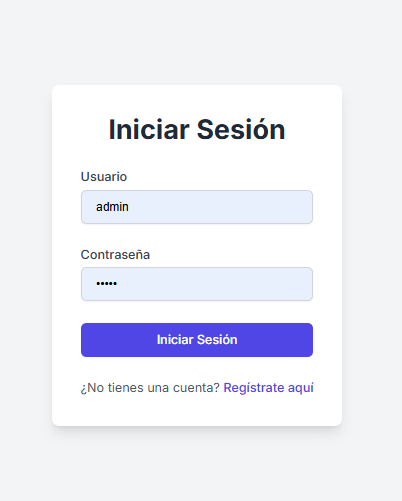
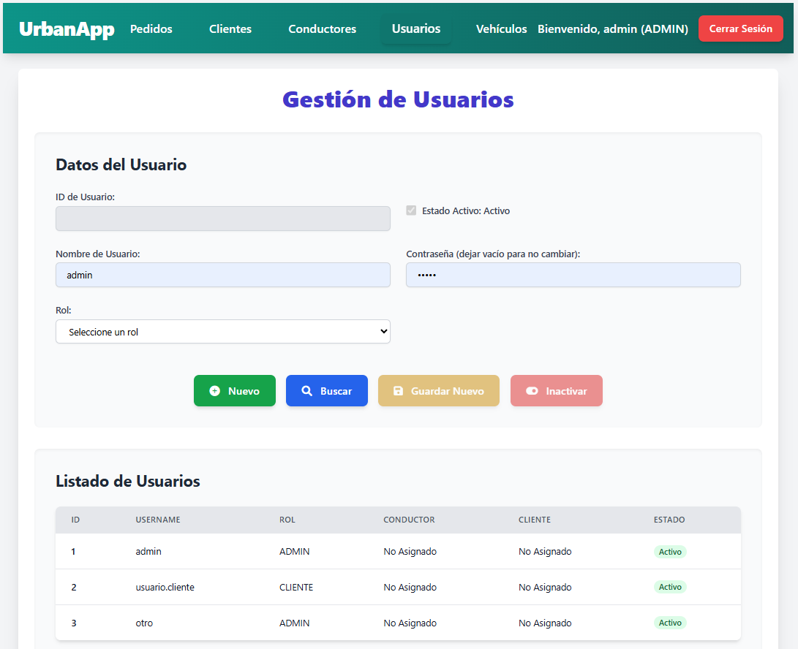
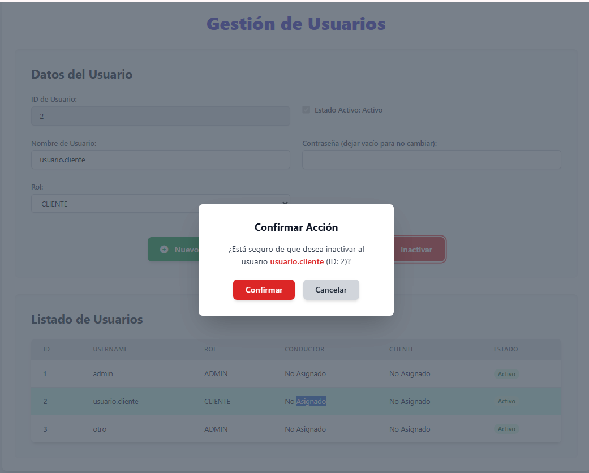
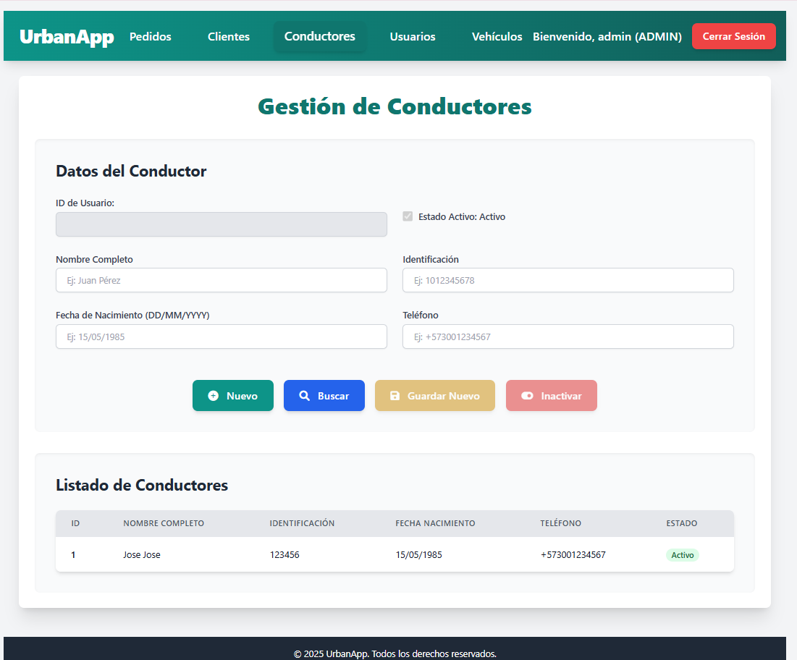

# UrbanFront - Aplicación de Gestión de Transporte Urbano (Frontend)

## Descripción del Proyecto

Este proyecto es la interfaz de usuario (frontend) para el sistema de gestión de transporte urbano. Desarrollado con Angular y Tailwind, permite a los usuarios interactuar con la [API RESTful del backend](https://github.com/fernanvergara/urbanfront.git)  para administrar conductores, usuarios, vehículos, pedidos y clientes de manera intuitiva, cabe agregar que este es un proyecto básico y que solo hay unas pocas funciones implementadas.

## Características Principales

* **Autenticación y Autorización:** Inicio de sesión seguro y gestión de acceso basada en roles (ADMIN, CONDUCTOR, CLIENTE).
* **Gestión de Usuarios:** Creación, edición, visualización y activación/desactivación lógica de usuarios.
* **Gestión de Conductores:** Administración completa de la información de los conductores.
* **Gestión de Vehículos:** Registro y control de la flota de vehículos. *No implementado.*
* **Gestión de Pedidos:** Creación y seguimiento del estado de los pedidos de transporte. *No implementado.*
* **Interfaz Responsiva:** Adaptada para diferentes tamaños de pantalla.

## Tecnologías Utilizadas

* **Angular 20.1** (o la versión que estés usando)
* **TypeScript**
* **HTML5**
* **CSS3 / SCSS**
* **Angular Material** 
* **Tailwind 3.4.3**
* **RxJS**
* **Node.js y npm/Yarn** (para el entorno de desarrollo)

## Requisitos Previos

Antes de ejecutar este proyecto, asegúrate de tener instalado lo siguiente:

* **Node.js** (versión recomendada por Angular CLI, ej: 18.x o 20.x)
* **npm** (viene con Node.js) o **Yarn**
* **Angular CLI** globalmente:
    ```bash
    npm install -g @angular/cli
    # o si usas yarn
    yarn global add @angular/cli
    ```
* **El backend de la aplicación debe estar en funcionamiento** (ej: `http://localhost:8080`).

## Instalación y Ejecución

Sigue estos pasos para configurar y ejecutar el proyecto localmente:

### 1. Clonar el Repositorio

```bash
git clone [https://github.com/fernanvergara/urbanfront.git](https://github.com/fernanvergara/urbanfront.git)
cd urbanfront
```

### 2. Instalar Dependencias

```bash
npm install
# o si usas yarn
yarn install
```

### 3. Configurar el Entorno

Asegúrate de que el archivo `src/environments/environment.ts` (y `environment.prod.ts` para producción) apunte a la URL correcta de tu API backend.

```typescript
// src/environments/environment.ts
export const environment = {
  production: false,
  apiUrl: 'http://localhost:8080/api' // Asegúrate de que esta sea la URL de tu backend
};
```

### 4. Ejecutar la Aplicación

```bash
ng serve
```

Esto iniciará el servidor de desarrollo de Angular. La aplicación estará disponible en `http://localhost:4200/` (o el puerto que se muestre en tu consola). Los cambios en el código se recargarán automáticamente. Validar que este puerto está habilitado en la API backend. 

## Vistas de la Aplicación

Aquí se muestran algunas de las pantallas clave de la aplicación:

### 1. Inicio de Sesión
La pantalla de inicio de sesión donde los usuarios ingresan sus credenciales para acceder al sistema.

<div style="text-align: center;">
    
</div>

### 2. Gestión de Usuarios
Una vista para que los administradores gestionen las cuentas de usuario, incluyendo la asignación de roles y la activación/desactivación.

<div style="text-align: center;">
    
</div>

### 3. Confirmación de Desactivación de Usuario
Ejemplo de un cuadro de diálogo de confirmación antes de realizar una acción crítica, como la desactivación de un usuario.

<div style="text-align: center;">
    
</div>

### 4. Gestión de Conductores
Interfaz para la administración de los datos de los conductores, permitiendo añadir, buscar, guardar y gestionar su estado.

<div style="text-align: center;">
    
</div>

## Construcción para Producción

Para construir la aplicación para despliegue en un entorno de producción:

```bash
ng build --configuration production
```

Este comando compila la aplicación en archivos estáticos optimizados que se guardarán en el directorio `dist/`. Estos archivos pueden ser servidos por cualquier servidor web (ej: Nginx, Apache) o un servicio de hosting de estáticos.

## Estructura del Proyecto (Ejemplo)

```
src/
├── app/
│   ├── components/                 # Componentes reutilizables (ej: navbar, footer)
│   ├── pages/                      # Componentes de página/vista (ej: login, dashboard, user-management). *No implmentado*
│   ├── services/                   # Servicios para la lógica de negocio y llamadas a la API
│   ├── models/                     # Interfaces y clases para los modelos de datos. *No implmentado*
│   ├── guards/                     # Guards de ruta para protección de acceso
│   ├── interceptors/               # Interceptores HTTP (ej: para JWT)
│   ├── app-routing.ts              # Configuración de rutas
│   ├── app.component.ts            # Módulo principal de la aplicación
│   └── ...
├── assets/                         # Imágenes, íconos y otros recursos estáticos. *No implmentado*
├── environments/                   # Archivos de configuración de entorno (ej: development, production)
├── styles.scss                     # Estilos globales de la aplicación
└── ...
```

## Contacto

Si tienes alguna pregunta o sugerencia, no dudes en contactarme:

* **Tu Nombre:** Fernan D. Vergara
* **Tu Email:** fernanvergara@gmail.com
* **Tu GitHub:** https://github.com/fernanvergara

---

**¡Gracias por usar esta aplicación!**
